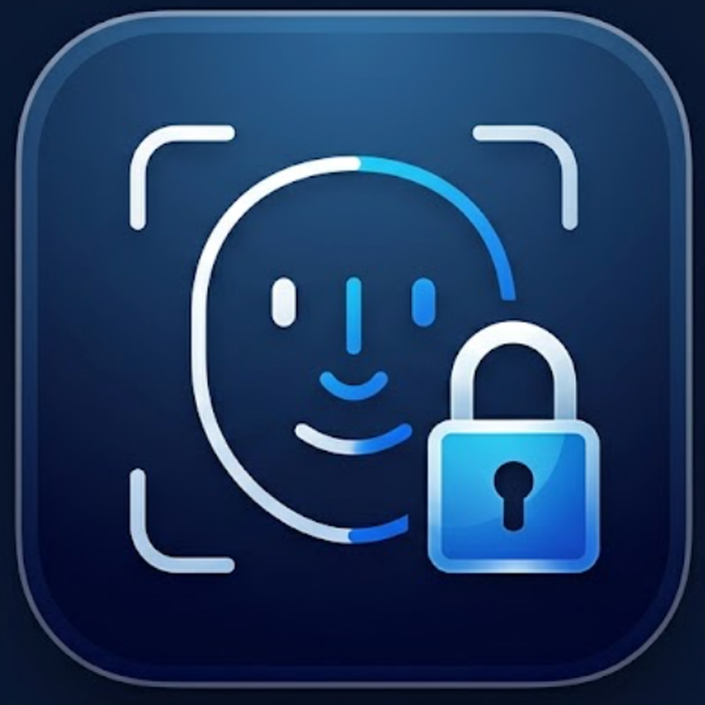
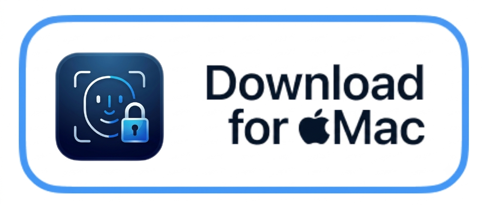

<h1 align="center">
  <br>
  
  <br>
  iFace
  <br>
</h1>

<h3 align="center">Face ID & App Lock for macOS</h3>

<p align="center">
  <a href="LICENSE"></a>
  
  
  
</p>

<p align="center">
  <a href="https://github.com/Ankushkushwaha1/iFace/releases">
    
  </a>
</p>

<!-- ======================================================== -->
<!-- DEMO VIDEO: Paste you

https://github.com/user-attachments/assets/53f28b22-dfa0-4051-8eee-bd13bd98ead3

r video link or drop your video below -->
<!-- https://github.com/user-attachments/assets/YOUR-VIDEO-ID -->
<!-- ======================================================== -->

**iFace** brings the seamless Apple Face ID experience to macOS. Unlock your Mac automatically with a single glance and protect your private applications behind instant biometric verification — no typing passwords or reaching for the keyboard.

Everything runs **100% on-device** using Apple's Vision and Core ML frameworks with hardware-backed encryption. The UI integrates directly into your MacBook's notch with fluid, Dynamic Island-style animations.

---

## Key Features

| Feature | Description |
|---|---|
| **App Lock** | Guard sensitive apps (WhatsApp, Photos, Telegram, Notes, etc.) behind Face ID. Shows a frosted glass shield and unlocks in milliseconds upon face recognition. |
| **Mac Screen Unlock** | Automatically unlocks your Mac on wake, lid open, display sleep recovery, or pressing Space at the lock screen. |
| **Notch & Dynamic Island UI** | Native fluid notch animations showing scan, verify, success, and retry states. Renders as a floating pill on notchless Macs and external displays. |
| **Multiple Identities** | Enroll multiple angles, lighting conditions, or trusted users with individual toggles. |
| **Anti-Spoofing & Liveness** | Analyzes multi-cue motion, micro-reflections, and 3D facial landmarks to reject photos and phone screens. |
| **Re-Lock Policies** | Customize app re-lock behavior: lock immediately on focus loss / minimize, or after a custom idle duration. |
| **Silent Operation** | Clean, silent password injection with optional trackpad haptic feedback. |
| **100% On-Device Privacy** | Zero cloud servers, zero network requests, and zero telemetry. Video frames are analyzed in memory and immediately discarded. |

---

## Security & Privacy by Design

### Biometric Embeddings
iFace never saves camera photos or video frames to disk. During enrollment, camera frames are transformed into a **512-dimensional vector embedding** using an ArcFace Core ML model. The raw image is instantly thrown away, and the embedding vector is stored encrypted locally with **AES-GCM**.

### Hardware-Backed Keychain
Your password is encrypted locally using AES-256 and protected by Apple Keychain `userPresence` (Touch ID or login credentials). Credentials are decrypted only in memory during an authorized unlock and immediately zeroed out.

---

## Installation & Setup

### Requirements
- macOS 15 Sequoia or later
- Apple Silicon (M1/M2/M3/M4) or Intel Mac
- Built-in FaceTime HD camera or external webcam

### Permissions Required
* **Camera**: Required to verify your face. Processed strictly in memory and never saved to disk.
* **Accessibility**: Required to type your credentials into the macOS lock screen.
* **Touch ID / Keychain**: Protects stored credentials and encryption keys.

---

## Building from Source

```bash
# 1. Clone the repository
git clone https://github.com/Ankushkushwaha1/iFace.git
cd iFace

# 2. Open the Xcode project
open iFace.xcodeproj

# 3. Build & Run
# Press Cmd + R in Xcode
```

---

## Acknowledgements

- **[The Boring Notch](https://github.com/TheBoredTeam/boring.notch)** — Notch window physics inspiration.
- **[InsightFace](https://github.com/deepinsight/insightface)** — ArcFace facial representation architecture.

---

## License

[MIT License](LICENSE) © 2026 **Ankush Kushwaha**
